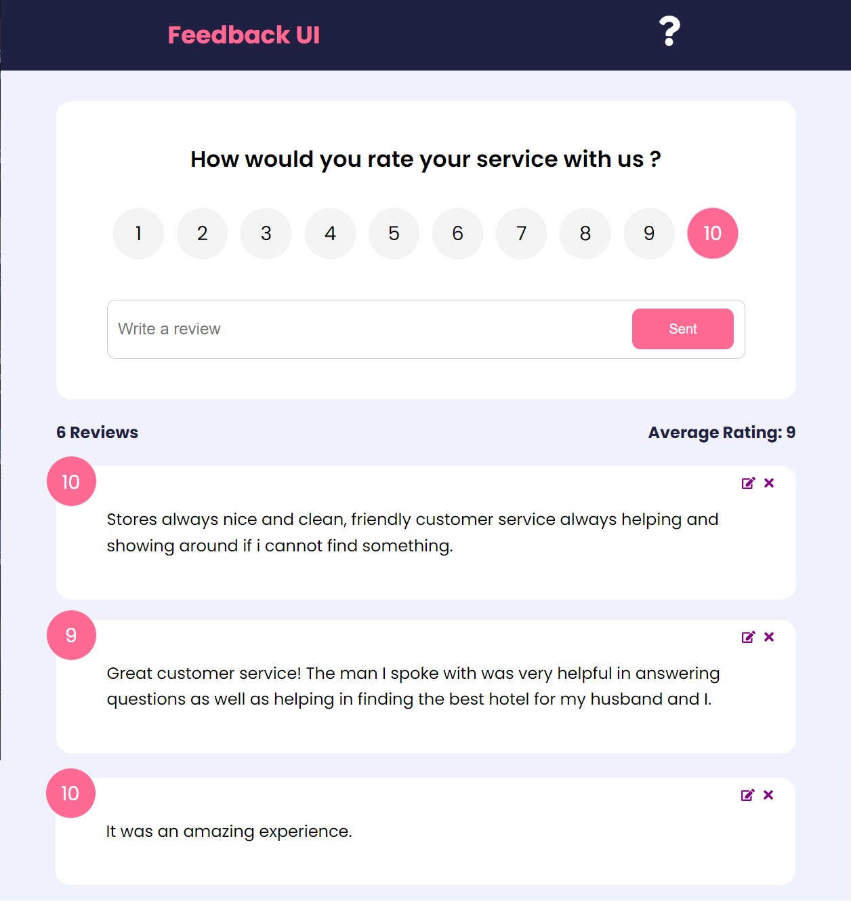

FEEDBACK APP

This is a React project that allows users to leave feedback on a website for a product or a service.

In the client side the state is managed by Context API. For the backend, Json server is used to create a mock rest API to make request to.

